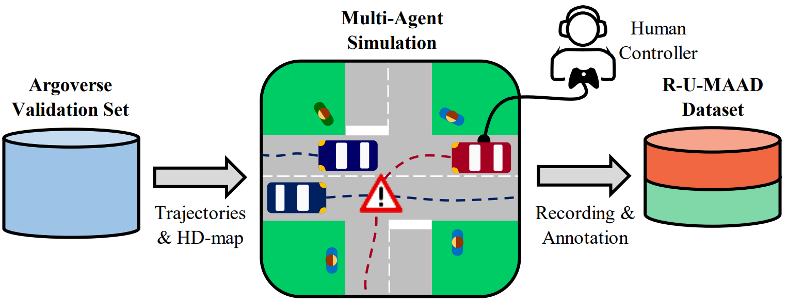

# A Benchmark for Unsupervised Anomaly Detection in Multi-Agent Trajectories
This is the official repository including the paper, code, baseline models and the R-U-MAAD dataset. Follow the README to set-up the project or jump to the section of interest with the [Table of Contents](#table-of-contents).

**A Benchmark for Unsupervised Anomaly Detection in Multi-Agent Trajectories**
<br>
Julian Wiederer, Julian Schmidt, Ulrich Kressel, Klaus Dietmayer and Vasileios Belagiannis
<br>
*Accepted at [ITSC 2022](https://www.ieee-itsc2022.org/#/) in Macau, China.*
<br>

<!------>

<div align="center">

</div>

## Table of Contents
  * [Installation](#installation)
  * [R-U-MAAD Dataset](#r-u-maad-dataset)
  * [Baseline Models](#baseline-models)
  * [Experiments](#experiments)
  * [Citation](#citation)

At this point, we would like to thank the authors of the paper [Learning Lane Graph Representations
for Motion Forecasting](https://www.ecva.net/papers/eccv_2020/papers_ECCV/papers/123470528.pdf) for their great work and for making their code publicly available. This project makes use of parts of the source code. We mark the files which include code from the original [LaneGCN](https://github.com/uber-research/LaneGCN) repository by a statement in the file header.


## Installation

Install Anaconda as described on the following page:\
https://docs.anaconda.com/anaconda/install/linux/

Create the conda environment

```sh
conda env create -f environment.yml
```

Activate the environment
```sh
conda activate r_u_maad
```

Install the Argoverse API
```sh
pip install git+https://github.com/argoai/argoverse-api.git
```

## R-U-MAAD Dataset

The R-U-MAAD dataset is composed of our R-U-MAAD test set and the Argoverse train and val sets. The following gives details on the license, access request, download, pre-processing and the final file structure.

### License

<a rel="license" href="http://creativecommons.org/licenses/by-nc/4.0/">
</a><br />R-U-MAAD dataset is licensed under <a rel="license" href="http://creativecommons.org/licenses/by-nc/4.0/"
 >Creative Commons Attribution-NonCommercial 4.0 International License</a>.

### Requesting Access to the R-U-MAAD test data
To optain the R-U-MAAD test set (around 3 MB), please send an email to *r.u.maad.dataset@gmail.com* with subject matter
'[ITSC2022] R-U-MAAD Dataset - Access Request' stating the following:

&nbsp;&nbsp;&nbsp;&nbsp;&nbsp;&nbsp; *Your name, title and affiliation*
<br>
&nbsp;&nbsp;&nbsp;&nbsp;&nbsp;&nbsp; *Your intended use of the data*
<br>
&nbsp;&nbsp;&nbsp;&nbsp;&nbsp;&nbsp; The following license statement:
<br>
&nbsp;&nbsp;&nbsp;&nbsp;&nbsp;&nbsp; *With this e-mail I agree that I will use the TCG dataset following the Creative 
Common Attribution-NonCommercial 4.0 International License.*

We will promptly reply with a download link. Download the `.tar.gz` file and copy it into `/datasets/r_u_maad`.

### Download the Argoverse dataset
Download the argoverse train and val set (this might take a while depending on your internet connection):

```sh
./scripts/download_argoverse.sh
```

(You might need to run `chmod +x scripts/*` before)

### Extract train, val and test
Run

```sh
./scripts/extract_train_val_test.sh
```

to extract the train, val and test sets.

### Preprocess the Dataset

To pre-process the train, val and test set for using it with our models run

````sh
bash scripts/preprocess_r_u_maad.sh
````

Note, especially the pre-processing of the train and val files might take a couple of hours. In addition, >32 GB RAM is required.

The pre-preprocessing extracts a random clip for train and val and uses a sliding window approach with stride 1 for test. The resulting .csv files are stored in the `sliding_window` directory. In the second pre-processing step, each, train, val and test files are combined in one pickle file stored in the `preprocess` directory for accelerated data loading. 

### Filesystem Tree

Target file structure:
```
datasets 
└───r_u_maad
   |   forecasting_train_v1.1.tar.gz
   |   forecasting_val_v1.1.tar.gz
   |   r_u_maad_test_v_1.0.tar.gz
   │
   └───train
   |    │  data
   └───val
   |    │  data
   └───test
   |    │  data
   |
   └───sliding_window
   |    |  train
   |    |  val
   |    |  test
   |
   └───preprocess
        |  train
        |  val
        |  test

```

`train`, `val` and `test` contain the raw .csv files wiht train and val from Argoverse and our test files. 
The train and val .csv files consist of the same columns as described in the Argoverse datset.
The test data has additional columns including the behavior and sub-behavior labels:

- a VALID tag, with 0=invalid, 1=valid, 2=ignore,
- the BEHAVIOR labels, with 0=normal and 1=abnormal,
- the SUBCLASS indices the sub-behavior depending given the BEHAVIOR label,
- the FRAME_ID is used in the pre-processing.

## Baseline Models
Donwload the [baseline models](https://drive.google.com/file/d/1GBySn-UJ6Svd1tVH8lqm9sXGp6oUv6Lw/view?usp=share_link) and

```
mv r_u_maad_baselines_v_1_0.zip experiments
cd experiments
unzip r_u_maad_baselines_v_1_0.zip
```

## Experiments
You can use the provided baseline models for inference directly, or train from scratch.

### Train
Set the `model` you would like to train in the `/config/default_train.yaml` config and run

````
python train.py --config default_train.yaml
````

### Test

Test the **linear models** or the **reconstruction models**: 

- `/config/default_test.yaml`: Set `model` to one of `{cvm, lti, seq2seq, stgae, lanegcn_ae}`,
- `/config/testing/default.yaml`: Set `run` to the corresponding model (wich selects the correct experiment folder),
- Finally, run
```sh
python3 test_linear_model.py --config=default_test.yaml
```

This will create a test directory in the corresponding run directory, e.g. `020_seq2seq/test_xyz`. It evaluates both the results on the major class, i.e. abnormal vs. normal, and on the minor class labels for the abnormal cases.

If you would like to test your own model, you need to parameterize as follows:

- `/config/default_test.yaml`: Set `model` to `your_model_name`,
- `/config/testing/default.yaml`: Add your `your_model_name` to the `runs` list with corresponding folder in the `experiments` directory,
- The model configuration file needs to be stored in `/config/model/your_model_name.yaml`

## Citation
If you use our source code, please cite:
```bibtex
@InProceedings{wiederer2022rumaad,
  author={Julian Wiederer and Julian Schmidt and Ulrich Kressel and Klaus Dietmayer and Vasileios Belagiannis},
  booktitle={2022 IEEE International Conference Intelligent Transportation Systems}, 
  title={A Benchmark for Unsupervised Anomaly Detection in Multi-Agent Trajectories}, 
  year={2022},
  pages={},}
```